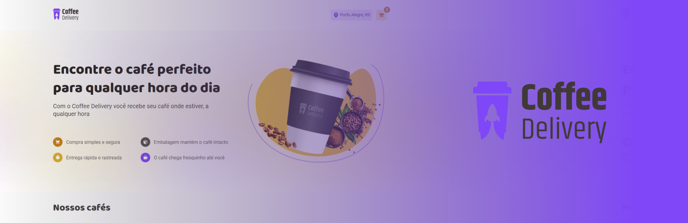

# ☕ | Coffee Delivery

Bem-vindo(a) ao repositório que contém a solução para o desafio Ignite da [@Rocketseat](https://www.rocketseat.com.br/).

O objetivo desse desafio é estudar as ferramentas e tecnologias de desenvolvimento web utilizadas neste projeto, o qual se encontra em constante atualização (melhorias podem ser implementadas a qualquer momento).

Happy hacking!

> ⚠️ **É importante ressaltar que este projeto/repositório se encontra em constante atualização.**

## 🧠 Contexto



O desafio consistia em criar uma interface e-commerce para venda de produtos relacionados ao consumo de café com as seguintes ferramentas:

- [x] Vite
- [x] Styled-components
- [x] Local storage
- [x] TypeScript
- [x] Context API
- [x] React-router-dom
- [x] React-hook-form
- [x] Form validations with Zod

## 🤝 Colaboradores

<table>
  <tr>
    <td align="center">
      <a href="https://github.com/LDNzera" title="Pedro Galembeck">
        <br>
        <sub>
          <b>Pedro Galembeck</b>
        </sub>
      </a>
    </td>
    <td align="center">
      <a href="https://github.com/Rocketseat/" title="Rocketseat">
        <br>
        <sub>
          <b>Rocketseat</b>
        </sub>
      </a>
    </td>
  </tr>
</table>

## 📋 Instruções

Para utilizar o projeto acima, basta seguir as instruções abaixo.

- Siga esse [protótipo](<https://www.figma.com/file/BcP48N0GAlF9y1dzwHIvMZ/Coffee-Delivery-%E2%80%A2-Desafio-React-(Copy)?type=design&mode=design>).
- Utilize o [deploy](https://coffee-delivery-galembeck.vercel.app/) na vercel para abrir o link de visualização.
  > https://coffee-delivery-galembeck.vercel.app/

## 🖥️ Instalação

### Coffee Delivery

1. Clone este repositório:

```bash
git clone https://github.com/LDNzera/coffee-delivery.git
```

1. Abra a pasta do projeto (_coffee-delivery_):

```bash
cd coffee-delivery
```

3. Instale as dependências utilizadas:

```bash
npm install
```

3. Inicie o projeto:

```bash
npm run dev
```

Made with 💜 by Pedro Galembeck.
